Roosta's assets
===============

Static asset repository for various projects. I don't like polluting my git
history with binary blobs so I track all static assets here.

## Dotfiles
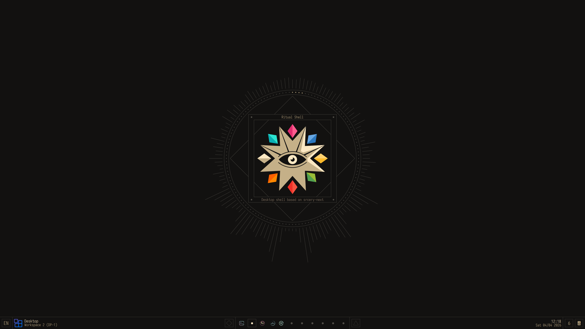

<video src="https://github.com/user-attachments/assets/63304a4e-1961-4533-91ca-aec0c2b92a6f" controls width="800"></video>
## fif
<video src="https://github.com/user-attachments/assets/5f3cf557-162a-43c7-abff-dfdd5fae900d" controls width="800"></video>

## etc

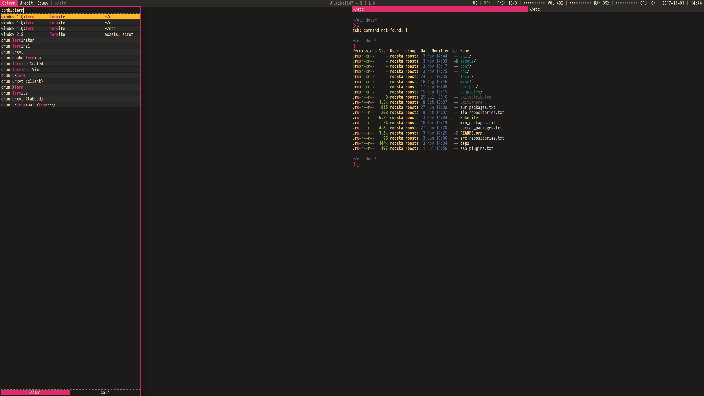
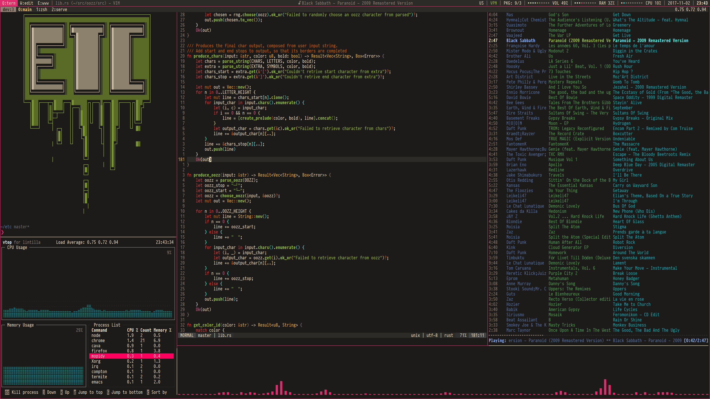
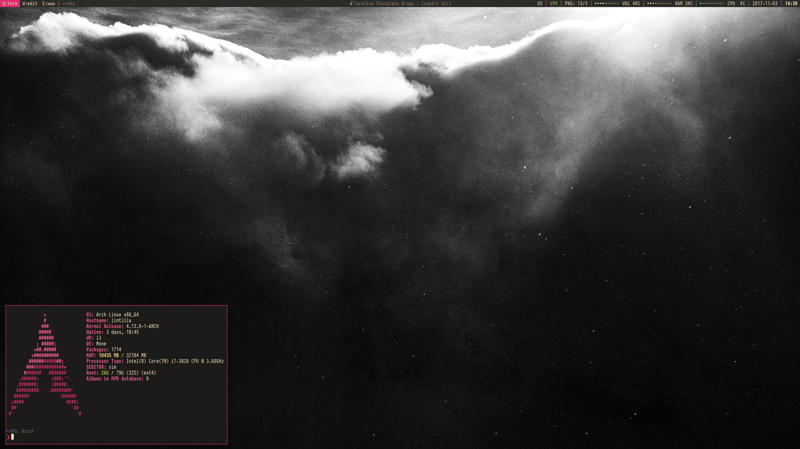
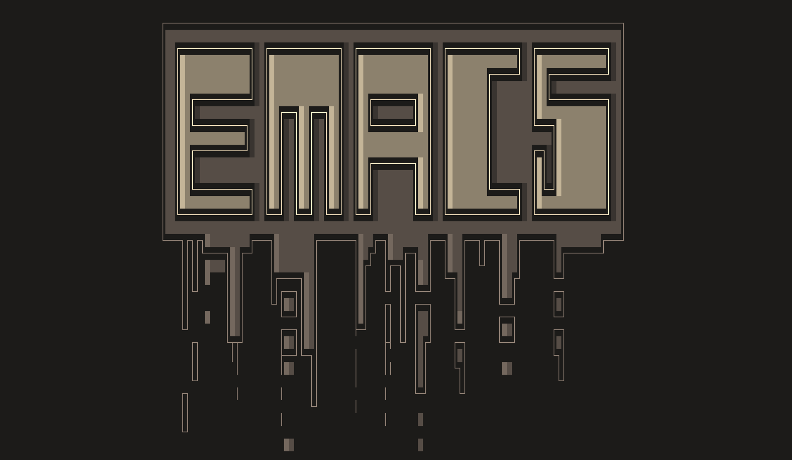

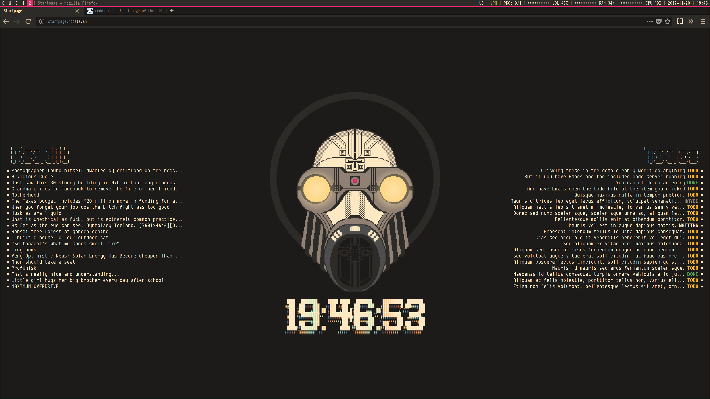
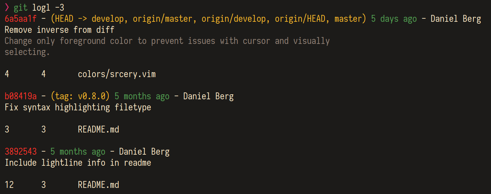
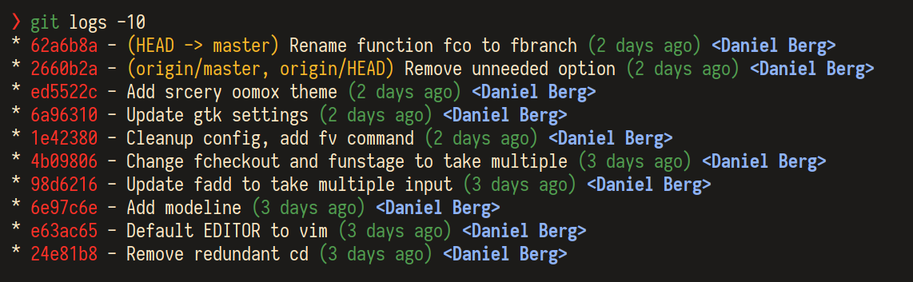
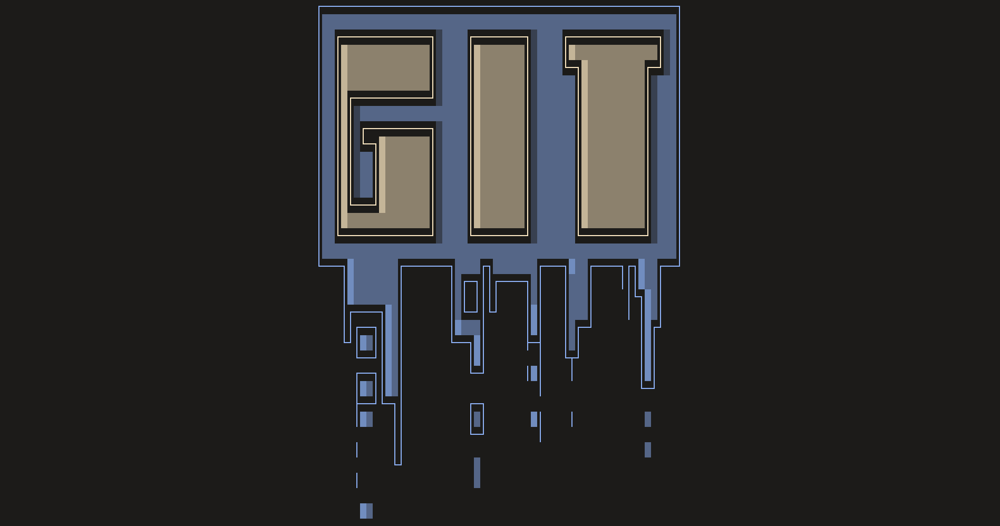
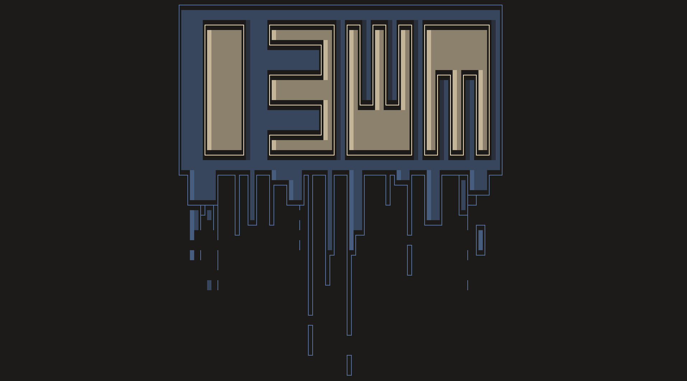
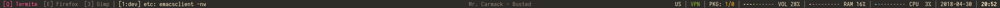
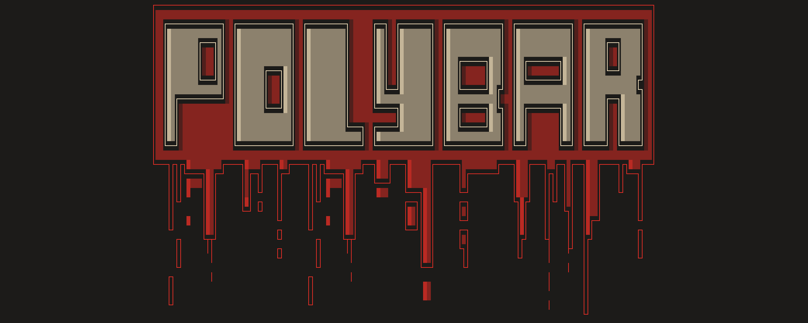
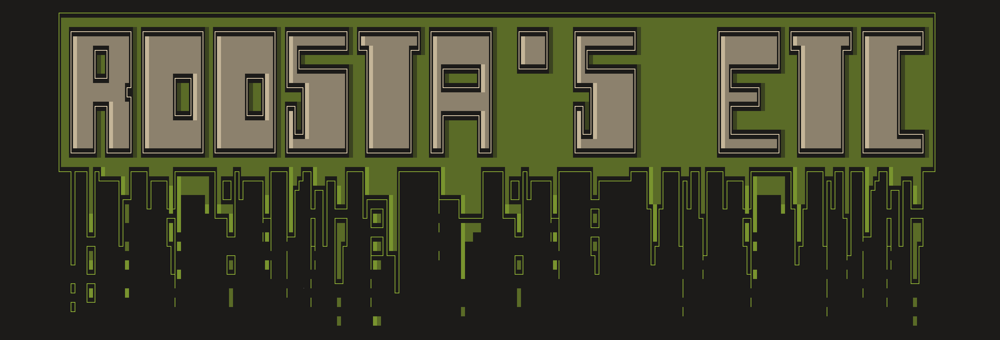
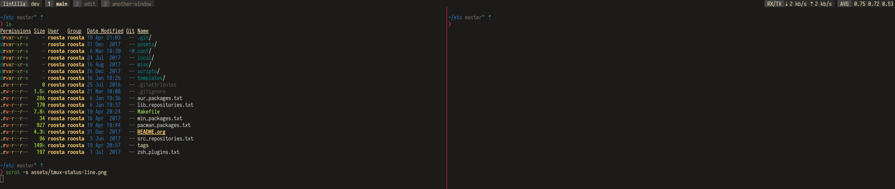

## tmux-fuzzback

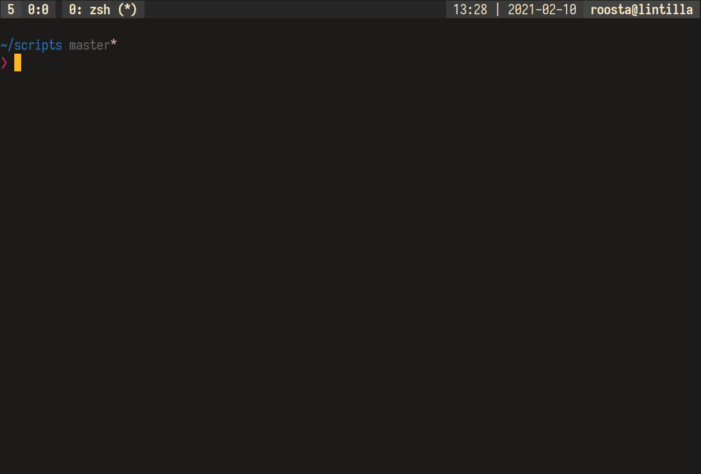

## ritual-firefox-theme

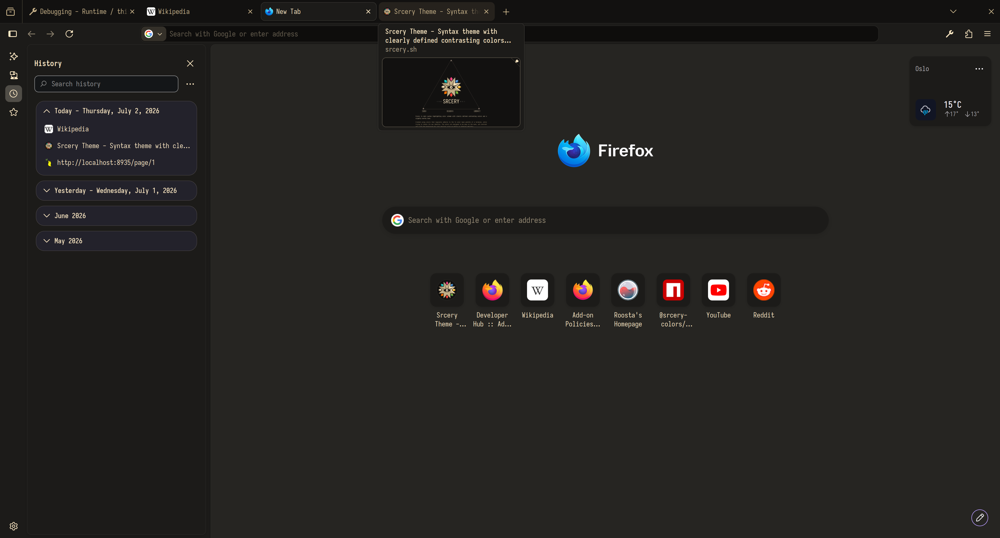
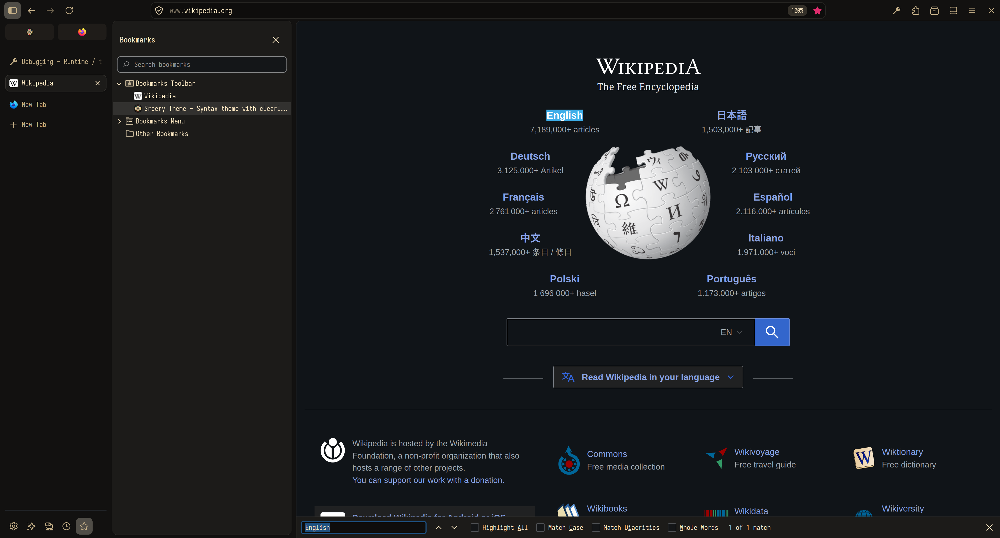

----
Copyright (c) 2020 Daniel Berg (roosta)
